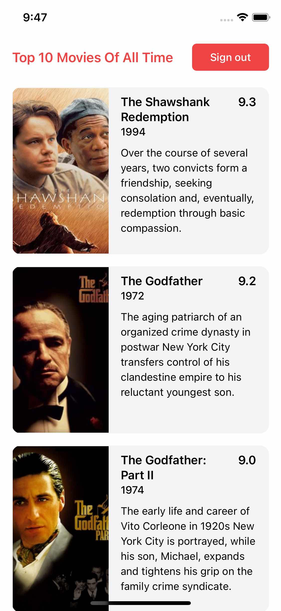

# Movie Magic 2

A sample application to demonstrate the use of basic UI components such as
buttons, forms and lists.

### Home Page


### Sign In Form


### Top 10 Movies



## Building Movie Magic 2

Make sure that React Native is correctly installed (see
[React Native CLI Quickstart](https://reactnative.dev/docs/environment-setup)).

Also, make sure that the iOS Simulator is running.

Now follow these steps:

```shell
yarn
yarn pod-install  # pod install with RCT_NEW_ARCH_ENABLED=1
yarn ios
```
